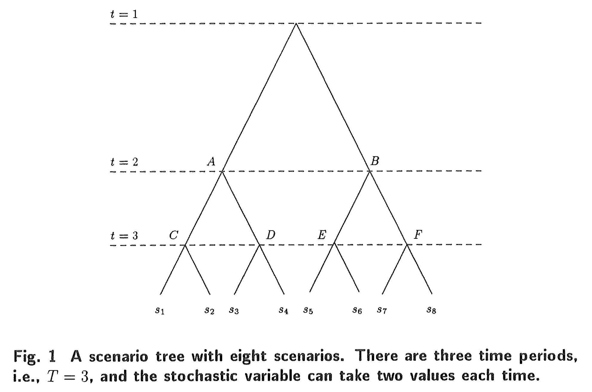

# Scenario Analysis and the Progressive Hedging Algorithm-Simple Numerical Examples

## 0. Abstract

The Progressive Hedging Algorithm (PHA) is a new method which may be applied to multiperiod optimization problems under uncertainty. 

渐进对冲算法是一种用于含有不确定性多周期优化问题的新方法.

It was first presented in Rockafellar and Wets (1991). 

与1991年由Rockafellar 和 Wets 首次提出.

In their paper no examples are given and the main emphasize is on the proofs and convergence analysis. 

在Rockafellar 和 Wets的论文中主要重点放在证明和收敛性分析上, 并没有给出具体的例子.

Therefore, in order to understand the idea behind scenario analysis and PHA very simple numerical examples are given in this paper and the results are compared to results derived from classical stochastic  optimization methods. 

因此，为了理解情景分析背后的思想, 本文给出了渐进对冲算法的简单数值计算示例. 同时比较了经典随机规划方法的结果.

**Key Words**: Progressive Hedging; Scenario Analysis; Stochastic Optimization.

**关键词**：渐进对冲；情景分析；随机规划 

-------------

## 1. Introduction

Many optimization problems with practical origin incorporate stochastic elements. 

很多实际场景中的优化问题含有随机的因素.

In general it is very difficult to solve stochastic problems.

通常求解随机问题是很困难的. 

This is due to either the mathematical properties (in particular if the space for stochasticity is infinite) or to the computational burden due to the combinatorial explosion (in the case with discrete stochastic events).

这是由于数学特性(特别是在随机空间是无限的情况下), 或者是由于组合爆炸(在具有离散随机事件的情况下)所引发的计算负担问题.

Only few specific models can be solved easily, in particular the unconstrained Quadratic-Linear model with normally distributed stochastic elements. 

只有少数特定模型可以轻松求解, 特别是具有正态分布随机元素的无约束二次线性模型.

For an introduction to the classical material the readers are referred to Jensson (1975) (for a Mathematical Programming approach) and to Bertsekas (1987) (for the Dynamic Programming approach). 

对于经典材料的介绍，读者可以参考Jensson(1975)(针对数学编程方法)和Bertsekas(1987)(针对动态编程方法).

------------

Recently, stochastic optimization problems have received renewed interest. 

最近，随机优化问题重新引起了人们的兴趣.

One of the promising approaches is based on scenario analysis, which is a stochastic programming technique employing discrete scenarios with known probabilities, usually covering several time periods. 

一种有前途的方法是基于情景分析的方法, 这是一种随机规划技术. 情景分析方法中引入了已知概率的离散情景，通常情景中含有多个时间段.

Figure 1 shows a scenario tree with eight scenarios. 

图1显示了一棵含有八个情景的情景树. 该情景树覆盖 $3$ 时间段，每个时间段处的随机变量由两个可取值.

Each of these eight scenarios are shown in Fig. 2. 

对应的8个情景如图2所示(也就是从根节点到叶子节点的一条路径).

-----------

The Progressive Hedging Algorithm (PHA) is a method to solve scenario problems. 

渐进对冲算法是一种求解情景问题的方法.

The PHA was first presented in Rockafellar and Wets (1991).

渐进对冲算法于1991年由 Rockafellar 和 Wets 首次提出.

Since then this method has been studied in several papers, e.g., Robinson (1991), Dembo (1991), Helgason and Wallace (1991), Wallace and Helgason (1991), and Palsson and Ravn (1993). 

至此渐进对冲算法为多篇论文所讨论. 例如：Robinson (1991), Dembo (1991), Helgason and Wallace (1991), Wallace and Helgason (1991), and Palsson and Ravn (1993). 

In Helgason and Wallace (1991) it is shown how PHA can be combined with approximate solution of the individual scenario problems, resulting in a computationally effcient algorithm where two individual Lagrangian-based procedures are merged into one. 

在1991年Helgason和Wallace的论文中描述了渐进对冲算法是如何将各个情景问题的近似解结合起来的，同时提出了一种将两个独立的拉格朗日过程合并起来的有效算法.

This method is used to study examples from fisheries management. 

所提出的方法被应用于渔业管理的实例问题中.

In Wallace and Helgason (1991) the structural properties of the PHA is discussed. 

在1991年Wallace和Helgason的论文中讨论了渐进对冲算法的结构属性.

In Palsson and Ravn (1993) the PHA is applied to the management of a heat storage.

在1993年Palsson和Ravn的论文中，渐进对冲算法被应用到热存储管理.

--------

The purpose of this paper is to give an easy introduction to the PHA. 

本论文的目的是为渐进对冲算法做一个简单的介绍.

The paper starts with the description of the scenario analysis in connection with the decision problem. 

本文从描述与决策问题有关的情景分析开始.

Then the PHA and some definitions needed are given, simple numerical examples are studied, and finally some concluding remarks are given.

然后给出了与渐进对冲算法和与算法相关的定义；其后给出了一个简单数值计算的例子；最后给出一些结论. 

------

## 2. Scenario Analysis

The present paper considers decision problems that are sequential in nature.

本文本质上讨论的是一个序列决策问题.

This means that the decision vector $X\in\mathbb{R}^n$ is departed: $X=(x_{1}',x_{2}',\dots,x_{T}')'$.

Thus, there are $T$ stages and each stage $t$ one decision $x_t$ must be made, first $x_{1}$, than $x_2$, etc.

因此，在含有 $T$ 阶段(或周期) 以及每个阶段(周期) $t$ 必须做一个决策 $x_t$，首先是 $x_1$，然后 $x_2$，等等.

A sequence of decisions is called a policy.

一个决策序列称为一种策略.

----------

The information structure is also sequential. 

信息的结构也是序列化的.

Thus, each time a decision is made some information is gained.

因此, 在每个周期做完决策后，便会反馈一些信息. 

-----------

The information structure is described by scenarios.

信息的结构通过情景来描述. 

The uncertainty about parameters or components of the system is modeled by a small number of subproblems. 

系统参数或组件(例如，需求)的不确定性由少量的子问题(或情景)来建模表达.

Each version is called a *scenario*. 

每个子问题被称作一个情景.

The set of scenarios is denoted by $S$.

所有情景构成的集合表示为 $S$.

------------------

Each scenario $s$ is supposed to take place with probability $p_s$:

每个情景 $s$ 假设以概率 $p_s$ 发生，且满足：
$$
\begin{align*}
p_s > 0, &\sum\limits_{s\in S}{p_{s}}=1 &(1)
\end{align*}
$$
Eight scenarios are indicated in Fig. 1. 

在图1中标定了 8 个情景.

The sequential nature of the problem is indicated by the sequence of stages $t=1$, $t=2$ and $t=3$. 

子问题(或情景)的序列特性由阶段 $t=1$, $t=2$ 和 $t=3$ 的顺序来表示.

Thus, $x_t$ must be chosen three times.

因此，决策 $x_t$ 必须做3次. 

Information is also gained three times, after a decision is made. 

则信息也会反馈3次

Thus, at the time $x_1$ must be chosen, it is not known which of the eight scenarios, $s_1,\dots,s_{8}$, will take place.

因此，当决策选择 $x_1$ 时，我们是无法判断 8 种情景 $s_1,\dots,s_8$ 那种情景会发生.

The choice of must be made, and then the state will be in one of the two points $A$ or $B$.

必须做出选择，然后状态为 $A$ 或 $B$ 中的一个. 

If the actual scenario was $s_1$, $s_2$, $s_3$ or $s_4$ the state will be in $A$, if the actual scenario was $s_5,s_6,s_7$ or $s_8$ the state with be in $B$.

如果实际情景 $s_1,s_2,s_3,s_4$ 的状态属于 $A$, 如果实际情景 $s_5,s_6,s_7,s_8$ 的状态属于 $B$.

------------

It is assumed that after $x_1$ is chosen it can be observed, whether the state is in $A$ or $B$, and therefore information is gained. 

假设在决策 $x_1$ 选择后，状态是可观察的，即属于 $A$ 或 $B$ 是可知的，因此便获得了新的信息.

----------

Now $x_2$ must be chosen, and then the state will end up in $C$ or $D$ (if the state is in $A$) or $E$ or $F$ (if the state is in $B$), and so on. 

现在决策 $x_2$ 必须做出选择，其后的状态将会出现 $C$ 或 $D$ (如果决策 $x_2$ 之前的状态为 $A$ 的话)，或者将会出现 $E$ 或 $F$ (如果决策 $x_2$ 之前的状态为 $B$ 的话)，以此类推.

-----------

This decision process has two kinds of requirement to the choice of $x_t$ at each stage. 

该决策过程在每个阶段对 $x_t$ 的选择有两类要求.

First, there is the requirement that $x_t$ must be admissible.

首先， 要求 $x_t$ 必须是 admissible.

This means that $x_t$ must be chosen from some set $C_s$.

意思是 $x_t$ 必须来自于某个集合 $C_s$ 

----------

Second there is the requirement that $x_t$ be *implementable*. 

第二，要求 $x_t$ 必须是 implementable.

This refers to the information structure.

这指的是信息的结构. 

Thus, when $x_t$ is chosen at stage $t$ only the knowledge which has been gained until then is available.

因此，当阶段$t$ 选择 $x_t$ 时，只有在那之前获得的知识才可用.

----------

This can be formulated more specifically as follows. 

可以通过如下进行具体地形式化.

As seen from Fig. 1 - 2 there are relations between the scenarios. 

从图1-2可以看出，场景之间存在关联.

Thus, at stage $t = 2$ the scenarios fall in two groups: one contains scenarios $s_{1},\dots,s_{4}$, the other scenarios $s_{5},\dots,s_{8}$. 

因此，在阶段 $t=2$ 时，情景集中的情景划分为了两组：一组包含情景 $s_1,\dots,s_4$，另一组包含情景 $s_5,\dots,s_8$.

Similarly at stage $t = 3$ there are four groups of scenarios, each group with two scenarios. 

类似地，在阶段 $t=3$ 时，有4个情景组，每个情景组中含有两个情景.

----------

Such a group is denoted as a *scenario bundle*. 

一个情景组表示为一个 scenario bundle.

As seen, the scenario bundles at time $t$ are such that the scenarios in each bundle are observationally indistinguishable at time $t$.

诚如所见，在时间点 $t$ 时的 scenario bundles 

------------

Therefore, the requirement of implementability can now be stated as follows:

因此，现在可以将可实现性要求描述如下：

> The policy is implementable if for all $t$, $x_t$ is dependent on the scenario bundle but not on the particular scenario in the bundle.
>
> 如果对于所有时刻 $t$，$x_t$ 取决于scenario bundle，而不取决于bundle中某个特定的scenario，则该策略是implementable.

-----

At any time $t$, it is known what scenario bundle is relevant for the decision. 

在任何时刻 $t$，都知道哪个 scenario bundle 与 $x_t$ 相关.

Thus, at stage $t = 2$ on Fig. 1 it is known if the relevant scenario bundle contains $s_{1},\dots,s_{4}$ (this is the case if the state is at $A$) or $s_5,\dots,s_8$, (if the state is at $B$).

因此，在图1的阶段 $t=2$，知道相关scenario bundle是否包含 $s_{1},\dots,s_{4}$ (如果状态为 $A$，就是这种情况) 或 $s_5,\dots,s_8$ (如果状态为 $B$).

------------------------------

The decision problem can now be formulated as follows. 

决策问题现在可以形式化为如下.

There is a sequential decision and information gaining process, defined by scenarios $s\in S$ with probabilities $p_s$, see Eq. (1). 

有一个序列决策和信息获取过程，其中信息的获取过程由情景 $s\in S$ 和情景概率 $p_s$ 定义，请参见 Eq. (1).

To each decision $X \in \mathcal{R}^n$ and each scenario $s \in S$ there is a constant set $C_s$ and an objective function value $f_{s}(X(s))$ can be calculated. 

对于每个决策 $X\in \mathcal{R}^n$ 和每个情景 $s\in S$，都有一个常数集 $C_s$ 和一个目标函数值 $f_{s}(X(s))$ 可以被计算.

-----------

The purpose is to minimize the expectation, i.e., to solve

目标是使期望最小化，即求解
$$
\begin{align*}
&\min\sum\limits_{s\in S}{p_sf_s(X(s))} &(2)
\end{align*}
$$
subject to

服从于
$$
\begin{align*}
&X(s)\in\mathcal{C}_s &(3)
\end{align*}
$$
and

以及
$$
\begin{align*}
&X(s) \text{ is implementable} &(4)
\end{align*}
$$

------------

This problem is diffcult to solve in general. 

该问题通常难以求解.

The algorithm described below is based on the assumption that if it is known which scenario $s\in S$ is relevant then the optimal solution to this deterministic problem:

下面描述的算法基于以下假设：如果知道哪个情景 $s\in S$是相关的，则此确定性问题的最优解：
$$
\begin{align*}
&\min{f_{s}(X(s))} &(5) \\
&X(s)\in C_{s} &(6)
\end{align*}
$$
is easily found for any $s\in S$.

很容易找到 $S$ 中的任何$s$.

------------

If this is true the following problem can also easily be solved

如果是这样，则以下问题也可以轻松解决
$$
\begin{align*}
&\min{f_s(X(s)) + X'(s)W + \frac{1}{2}r||X(s)-\hat{X}||^{2}} &(7) \\
&X(s)\in C_{s} &(8)
\end{align*}
$$
for any $s\in S$. In Eqs. (7) - (8) $\hat{X}$ is a given value in $\mathbb{R}^n$, $W$ is a given value in $\mathbb{R}^n$, $X'W$ is the scalar product of $X$ and $W$, $r\in \mathbb{R}$，$r>0$，and $||\cdot||$ is the Euclidean norm.

对于任何 $s\in S$. 在等式(7)-(8) ：

+ $\hat{X}$ 是在 $\mathbb{R}^n$ 中的给定值
+ $W$ 是在 $\mathbb{R}^n$
+ $X'W$ 是 $X$ 和 $W$ 的标量积
+ $r\in \mathbb{R}, r>0$
+ $||\cdot||$ 是欧几里得范数

-----------

The relation between the problems in Eqs. (5) - (6) and in Eqs. (7) - (8) may be interpreted as follows. 

在等式(5)-(6)中问题和在等式(7)-(8)中问题之间的关系可做如下解释.

------------------

To each of the potentially relevant bundles at stage $t$ the policy may be calculated

对于 $t$ 阶段中每个潜在相关的bundles，决策策略可以这样计算
$$
\begin{align*}
&\hat{X}_t = \frac{\sum{p_sX_{t}(s)}}{\sum{p_s}} &(9)
\end{align*}
$$

------------

In this, the summation are over the scenarios in the relevant bundle, and $X_t(s)$ is the solution at time $t$ to a problem like Eqs. (7) - (8). 

在这种情况下, 求和是在相关bundle中的scenarios上进行的, 并且 $X_t(s)$ 是时间点 $t$ 出对问题等式(7)-(8)的解.

It is seen that $\hat{X}_{t}$ in Eq. (9) can be interpreted as a conditional expectation, relative to the relevant scenario bundle, i.e., relative to the information available. 

可以看出, 等式(9) 中的 $\hat{X}_{t}$ 可以解释为相对于相关scenario bundle(即相对于可用信息)的一个条件期望.

It is also observed that by this definition $\hat{X}_t$ is implementable. 

还观察到，通过该定义，$\hat{X}_t$ 是implementable.

Moreover, if $C_s$ is convex and independent of the particular scenario in the bundle, then $\hat{X}_t$ is admissible. 

而且，如果 $C_s$ 是凸的并且独立于bundle中的特定scenario，则 $\hat{X}_t$ 是admissible.

-----------------------

The vector $W\in\mathbb{R}^n$ in Eq. (7) may now be interpreted as a Lagrange multiplier vector relative to the constraint in Eq. (9) (or similarly Eq. (4)) and the last term in Eq. (7) may be interpreted as a penalty term which is introduced in order to attain convergence stability in an algorithmic sense. 

等式(7)中的向量 $W\in\mathbb{R}^n$ 现在可以理解为相对于等式(9)(或类似于等式(4))中约束的拉格朗日乘数向量, 而等式(7)中的最后一项可理解为惩罚项，其引入是为了在算法意义上实现收敛稳定性而引入该惩罚项.

----------

In summary the project can be stated as follows: the decision problem in Eqs. (2) - (4) is solved by solving the following problem

总而言之，该项目可以陈述如下：等式(2)-(4)中的决策问题通过求解以下问题来解决
$$
\begin{align*}
&\min{\sum{p_sf_s(X(s))}} &(10) \\
X(s) &\in C_{s} &(11) \\
X(s) &= \hat{X} &(12) \\
\end{align*}
$$
where $\hat{X}$ is defined in Eq. (9), and Eq. (12) ensures that the solution is implementable.

其中 $\hat{X}$ 在等式$(9)$中定义，而等式(12)是为了确保解是implementable.

--------------

In Rockafellar and Wets (1991) an algorithm is given for solution of the problem in Eqs. (10) - (12). 

在1991年Rockafellar和Wets的论文中给出了求解等式(10)-(12)中的问题.

This is described in the next section.

算法细节将在下一章中描述.

---------

## 3. Progressive Hedging Algorithm

In this section the PHA is given as in Rockafellar and Wets (1991) and just the definitions needed are given. 

在本节中，渐进对冲算法的描述与在1991年Rockafellar和Wets论文中给出的描述一样，仅给出了所需的定义.

The readers are referred to Rockafellar and Wets(1991) for the details. 

有关渐进对冲算法的详细信息，请读者参阅Rockafellar和Wets的1991年的论文.

--------------------

**PROGRESSIVE HEDGING ALGORITHM.** 

In iteration $\nu$ (where $\nu=0,1,\dots$) one has an *admissible* but not *necessarily implementable* policy $X^{\nu}\in C$ and a *price system* $W^{\nu}\in M$. 

在迭代 $\nu$（其中 $\nu=0,1,\dots$)中，有一个 *admissible* 但不是 *necessarily implementable* 策略 $X^{\nu}\in C$ 和一个*price system* $W^{\nu}\in M$.

(

Initially one can take $X^{0}$ to be the policy obtained by letting $X^{0}(s)$ be for each scenario $s\in S$ an optimal solution to the given scenario subproblem ($P_{s}$). 

最初，可以使 $X^{0}$ 为策略, 方法是让 $X^{0}(s)$ 为每个情景 $s\in S$为给定情景子问题($P_{s}$).

One can take $W^0 = 0$.

我们可以取 $W^{0}=0$.

) 

-------------------------------------------------------------

**Step 1.** 

**步骤1.**

Calculate the policy $\hat{X}^{\nu} = JX^{\nu}$, which is implementable but not necessarily admissible. 

计算策略 $\hat{X}^{\nu}=JX^{\nu}$，该策略可以implementable, 但不一定necessarily admissible.

(If ever one wishes to stop, this policy $\hat{X}^{v}$ is to be offered as the best substitute yet available for a solution to $P$.)

(如果有人希望停止，则可以使用此策略 $\hat{X}^{v}$ 作为迄今为止可用于解决 $P$ 的最佳替代方法.）

-------------------------------------

**Step 2.** 

**步骤2.**

Calculate as $X^{\nu+1}$ an (approximately) optimal solution to the subproblem 

计算为 $X^{\nu+1}$(近似)子问题的最优解
$$
\begin{align*}
&(P^{\nu}) &\mathop{minimize}[F(X) + <X,W^{\nu}> + \frac{1}{2}r||X-\hat{X}^{\nu}||^{2}] &&\text{ over all } X\in C
\end{align*}
$$
This decomposes into solving (approximately) for each scenario $s\in S$ the subproblem

这分解为(近似)针对每个情景 $s\in S$ 中的子问题的求解
$$
\begin{align*}
&(P^{\nu}_{s}) &\mathop{minimize}[f_s(x) + x\cdot W^{\nu}(s) + \frac{1}{2}r|x-\hat{X}^{\nu}|^{2}] &&\text{ over all } X\in C_s
\end{align*}
$$
in order to get $X^{\nu + 1}(s)$. The policy $X^{\nu + 1}$ will again be admissible but not necessarily implementable.  

以获得 $X^{\nu+1}(s)$. 策略 $X^{\nu+1}$ 将再次 admissible，但不一定 necessarily implementable.

-------------

**Step 3.** 

**步骤3.**

Update from $W^{\nu}$ to $W^{\nu + 1}$ by the rule $W^{\nu + 1}=W^{\nu} + rKX^{v+1}$. 

通过规则 $W^{\nu+1}=W^{\nu}+rKX^{v+1}$，将 $W^{\nu}$ 更新为 $W^{\nu+1}$.

The price system $W^{\nu + 1}$ will again be in $M$. Return to Step 1 with $\nu$ replaced by $\nu + 1$. $\Box$

price system $ W ^ {\ nu + 1} $将再次位于 $M$ 中. 返回步骤1, 将 $\nu$ 替换为 $\nu+1$.

----------

The definitions and some comments are given in order of appearance:

定义以及注释按出现顺序罗列如下：

+ $\nu$ is an iteration number, [$\nu$ 是一个迭代数]

+ $X^{\nu}$ is the decision to be made at iteration $\nu$, $X^{\nu}\in \mathbb{R}^n$, [$X^{\nu}$ 是在迭代 $\nu$ 时的决策向量，$X^{\nu}\in \mathbb{R}^{n}$]

+ $C$ is a set of admissible polices, $C\subseteq \mathbb{R}^n$, [$C$ 是一个admissible的策略集合]

+ $W^{\nu}$ is a price system (Lagrange multiplier)，$W^{\nu} \in M \subset \mathbb{R}^n$, [$W^{\nu}$ 是一个price system (拉格朗日乘数)]

+ $M$ is a set, $M \subset \mathbb{R}^{n}$. $M$ is such that for each scenario bundle $A$ at stage $t$, $\sum\limits_{s\in A}{p_sW_t(s)} = 0$. 

  [$M$ 是一个集合, $M \subset \mathbb{R}^n$. 对于阶段 $t$ 的每个 scenario bundle $A$ 有$\sum\limits_{s\in A}{p_sW_{t}(s)}=0$]

  The algorithm secures that this is fulfilled, if $W^{0}$ fulfills it; the initial choice $W^{0} = 0$ fulfills it, 

  [如果 $W^{0}$ 满足，该算法可确保满足要求; 初始选择 $W^{0}=0$ 实现了它]

+ $X(s)$ is the decision to be made given the scenario $s$, 

  [$X(s)$是在情况 $s$ 下做出的决策],

+ $s$ is the scenario, [$s$ 是一个情景]

+ $S$ is the scenario set, [$S$ 是一个情景集]

+ $P_s$ is the scenario subproblem, [$P_s$ 是一个情景子问题]

+ $\hat{X}$ is a conditional expectation, defined as in Eq. (9) using $X = X^{\nu}$. 

  [$\hat{X}$ 是一个条件期望，参见等式(9)中的定义, 使用 $X=X^{\nu}$.]

  Observe that if $C_s$ is convex for all $s\in S$ then $\hat{X}$ is admissible,

  [请注意，如果 $C_s$ 对于所有 $s\in S$ 都是凸的，则 $\hat{X}$是 admissible,] 

+ $J$ is an aggregation operator (or conditional expectation operator relative to the given information structure and values $p_s$, i.e., $JX^{\nu}$ defines $\hat{X}$ as in Eq. (9) using $X=X^{\mu}$, where $p_s$ is the probability attached to $s$), 

  [$J$是一个聚合运算符(或相对于给定信息结构和值 $p_s$ 的条件期望运算符, 即 $JX^{\nu}$ 如等式(9)中那样定义 $\hat{X}$ $X= X^{\mu}$，其中 $p_s$ 是附加到 $s$ 的概率)]

+ $P$ is the scenario problem, [$P$ 是情景问题]

+ $F (X)$ is equal to $E\{f_s(X(s))\}$, where $E$ denotes the expectation value, see Eq. (10),

  [$F(X)$ 等于 $E\{f_s(X(s))\}$, 其中 $E$ 代表期望值, 参见等式(10)], 

+ $< , >$ is the inner product on Euclidean vector space, [$<,>$ 是欧式向量空间上的内积] 

+ $r$ is a penalty parameter $( > 0)$, [$r$ 是惩罚参数，$r>0$]

+ $||\cdot||$ is a norm, [$||\cdot||$ 是范数],

+ $f_s(x)$ is the objective function value for the scenario subproblem $s$ and decision $X$, 

  [$f_s(x)$是情景子问题 $s$ ​和决策 $X$ 的目标函数值],

+ $x$ is the decision to be made for the scenario subproblem,

  [$x$ 是为情景子问题所做的决策],

+ $|\cdot|$ is the ordinary Euclidean norm $(|x|=\sqrt{\sum{x_{i}^{2}}})$ ,

  [$|\cdot|$ 为普通欧几里得范数 ($|x|=\sqrt{\sum{x_{i}^{2}}}$)],

+ $C_s$ is a set of admissible polices for the scenario $s$, $C_s \subseteq \mathbb{R}^n$，

  [$C_s$ 是针对情景$s$ 一个admissible策略的集合，$C_{s}\subseteq \mathbb{R}^n$], 

+ $K$ is an operator ($KX=X-\hat{X}$), such that $KX^{\nu+1}$ in step 3 is equal to $X^{\nu+1}-\hat{X}^{\nu+1}$.

  [$K$ 是一个算子$KX=X-\hat{X}$), 这样在步骤3中 $KX^{\nu+1}$ 等于 $X^{\nu+1}-\hat{X}^{\nu+1}$].

-----------

**Remark:** 

As noted, $\hat{X}^{v+1}$ is needed in the update of $W^{\nu}$ to $W^{\nu+1}$ but in the way the algorithm is written in Rockafellar and Wets (1991), $\hat{X}^{v+1}$ is not available at that moment (first at Step 1 in the next iteration). 

如前所述，在将 $W^{\nu}$ 更新为 $W^{\nu+1}$ 时，需要 $\hat{X}^{v+1}$，但是要以写入算法的方式 Rockafellar and Wets(1991)，$\hat{X}^{\nu+1}$ 目前不可用(首先在下一个迭代的步骤1).

Therefore, it is recommended that the algorithm is rewritten as:

因此，建议将该算法重写为：

-------------

**Step 0.** Initialize. 
**Step 1.** Solve (approximately) for each scenario $s\in S$ the subproblem (in order to get $X^{\nu+1}(s)$). 
**Step 2.** Calculate the policy $\hat{X}^{\nu+1} = JX^{\nu}$. 
**Step 3.** Update from $W^{\nu}$ to $W^{\nu + 1}$. Return to Step 1 with $\nu$ replaced by $\nu+1$.  

------------

In Rockafellar and Wets (1991) it is shown, that if for any $s\in S$, $C_s$ is convex  and $f_s$ is convex, and some regularity conditions apply then the algorithm will converge to an optimal solution to Eqs. (10) - (12).

在1991年Rockafellar和Wets的论文中表明：如果对于任意的 $s\in S$, $C_s$ 和 $f_s$ 是凸集, 以及使用一些规则性条件，则等式(10)-(12) 收敛于最优解. 

The regularity conditions are what can be expected from basic mathematical programming theory. 

规则性条件是从基本的数学规划理论可以估计的.

The rate of convergence is linear. 

收敛速度是线性的.

It is also shown that the algorithm will converge if Eqs. (7) - (8) are solved only approximately, and the error bound is specified.

论文中还表明：如果等式(7)-(8) 指定仅近似求解且指定误差范围, 则该算法将收敛.

## 4. Numerical Example

In this section the PHA is used on simple stochastic optimization problems, the original algorithm is used. 

在本节中, 将渐进对冲算法应用于简单的随机优化问题，并使用原始算法.

### 4.1 Example 1

The problem is to find

问题是找到
$$
\begin{align*}
&\min\limits_{x}{E[(x-d)^2]} &(13) \\
\end{align*}
$$
subject to the constraint

服从于约束
$$
\begin{align*}
&3 \leq x \leq 6, x\in \mathbb{R} &(14)
\end{align*}
$$
$d$ can takes two values $[5, 2]$ with probabilities $[0.6, 0.4]$, respectively. 

$d$ 有两个可取值 $[5, 2]$，概率分别为 $[0.6, 0.4]$.

Thus, there are two scenarios, one with $d = 5$ and one with $d = 2$. 

因此，有两个情景，一种是 $d=5$，另一种是 $d=2$.

This is illustrated in Fig. 3

如图3所示.

It is observed that this problem is not sequential (except in a trivial sense)  since only one choice is made. 

可以发现这个问题不是序列的，因为只做一次决策选择.

------------

It is clearly seen from Eqs. (13) - (14), that the optimal solutions for the deterministic problem corresponding to each of the two scenarios are $X^{*}(s_1)=5$ and $X^{*}(s_2)=3$, respectively. 

从等式(13)-(14)可以清楚地看出，对于两个情景中每个情景都是确定性的问题，两个情景的最优解分别为 $X^{*}(s_1)=5$ 和 $X^{*}(s_2)=3$.

Now the Progressive Hedging Algorithm is applied to this problem.

现在将渐进对冲算法应用于例1.

--------

#### 4.1.1 PHA

+ $\nu=0$:

  $X^{0}=(5,3)$ (i.e. $X^{0}(s_1)=x_{1}^{0}=5$ and $X^{0}(s_2)=x_{2}^{0}=3$ )

  $W^{0}=(0,0)$ and $r=1$ (chosen).

  + **STEP 1:**

    $\hat{X}^{0}=p_{s,1}X^{0}(s_1) + p_{s,2}X^{0}(s_2)=0.6\times 5 + 0.4 \times 3 = 4.2$

    (this is admissible, i.e. $3\leq \hat{X}^{0}\leq 6$)

  + **STEP 2:**

    $s_1:\min{[(x_1-5)^2 + x_1 0 + \frac{1}{2}1(x_1-4.2)^2]}\Rightarrow X^{1}(s_1)=4.73$

    $s_2:\min{[(x_2-2)^2 + x_20 + \frac{1}{2}1(x_2-4.2)^2]}\Rightarrow X^{1}(s_2)=\cancel{2.73}$

    the solution must be admissible, i.e., $X^{1}(s_2)=3$

  + **STEP 3:**

    $W^{1}=W^{0} + r(X^{1}-\hat{X}^{1})=(0,0) + 1(4.73-4.04, 3.0-4.04)=(0.69,-1.04)$

+ $\nu=1$:

  + **STEP 1:**

    $\hat{X}^{1}=p_{s,1}X^{1}(s_1) + p_{s,2}X^{1}(s_2)=0.6\times 4.73 + 0.4 \times 3.0 = 4.04$

  + **STEP 2:**

    $s_1:\min{[(x_1-5)^2 + x_1 0.69 + \frac{1}{2}1(x_1-4.04)^2]}\Rightarrow X^{2}(s_1)=4.45$

    $s_2:\min{[(x_2-2)^2 + x_2(-1.04) + \frac{1}{2}1(x_2-4.04)^2]}\Rightarrow X^{2}(s_2)=3.03$

  + **STEP 3:**

    $W^{2}=(0.69,-1.04) + 1(4.45-3.88,3.03-3.88)=(1.26,-1.89)$

+ $\nu=2$:

  + **STEP 1:**

    $\hat{X}^{2}=p_{s,1}X^{2}(s_1) + p_{s,2}X^{2}(s_2)=0.6\times 4.45 + 0.4 \times 3.03 = 3.88$

  + **STEP 2:**

    $s_1:\min{[(x_1-5)^2 + x_1 1.26 + \frac{1}{2}1(x_1-3.88)^2]}\Rightarrow X^{3}(s_1)=4.21$

    $s_2:\min{[(x_2-2)^2 + x_2(-1.89) + \frac{1}{2}1(x_2-3.88)^2]}\Rightarrow X^{3}(s_2)=3.26$

  + **STEP 3:**

    $W^{3}=(1.26,-1.89) + 1(4.21-3.83,3.26-3.83)=(1.64,-2.46)$

+ $\nu=3$:

  + **STEP 1:**

    $\hat{X}^{3}=p_{s,1}X^{3}(s_1) + p_{s,2}X^{3}(s_2)=0.6\times 4.21 + 0.4 \times 3.26 = 3.83$

  + **STEP 2:**

    $s_1:\min{[(x_1-5)^2 + x_1 1.64 + \frac{1}{2}1(x_1-3.83)^2]}\Rightarrow X^{4}(s_1)=4.06$

    $s_2:\min{[(x_2-2)^2 + x_2(-2.46) + \frac{1}{2}1(x_2-3.83)^2]}\Rightarrow X^{4}(s_2)=3.43$

  + **STEP 3:**

    $W^{4}=(1.64,-2.46) + 1(4.06-3.83,3.43-3.83)=(1.89,-2.84)$

| $$\nu$$ | $$X(s_1)$$ | $$X(s_2)$$ | $$\hat{X}$$ | $$w_1$$ | $$w_2$$ | $$\hat{z}$$ | $$\hat{z}'$$ |
| :-----: | :--------: | :--------: | :---------: | :-----: | :-----: | :---------: | :----------: |
|    0    |    5.00    |    3.00    |    4.20     |  0.00   |  0.00   |    0.40     |     2.32     |
|    1    |    4.73    |    3.00    |    4.04     |  0.69   |  -1.04  |    0.44     |     2.22     |
|    2    |    4.45    |    3.03    |    3.88     |  1.26   |  -1.89  |    0.60     |     2.17     |
|    3    |    4.21    |    3.26    |    3.83     |  1.64   |  -2.46  |    1.01     |     2.16     |
|    4    |    4.06    |    3.43    |    3.81     |  1.89   |  -2.84  |    1.35     |     2.16     |
|    5    |    3.97    |    3.55    |    3.80     |  2.06   |  -3.09  |    1.60     |     2.16     |
|    6    |    3.91    |    3.63    |    3.80     |  2.18   |  -3.26  |    1.77     |     2.16     |
|    7    |    3.88    |    3.69    |    3.80     |  2.25   |  -3.38  |    1.90     |     2.16     |
|    8    |    3.85    |    3.73    |    3.80     |  2.30   |  -3.45  |    1.98     |     2.16     |
|    9    |    3.83    |    3.75    |    3.80     |  2.33   |  -3.50  |    2.04     |     2.16     |

#### 4.1.2 Mathematical Programming Approach

The stochastic problem could also be solved by solving

随机问题也可以通过解决
$$
\begin{align*}
&\min\limits_{x}{[p_{s,1}(x-d_1)^2 + p_{s,2}(x-d_2)^2]}=\min\limits_{x}{[0.6(x-5)^2+0.4(x-2)^2]} &(15)
\end{align*}
$$
with the constraint in Eq. (14).

服从公式 (14) 的约束.

This gives $x^{*}=3.8$, i.e., the same solution as before.

将得到 $x^{*}=3.8$, 与 4.1.1 例1 具有相同的解.

#### 4.1.3 Choice of the Penalty Parameter

In Helgason and Wallace (1991) it is pointed out that the choice of the penalty parameter $r$ is of vital importance and the conclusion drawn there is that the penalty should be as small as possible, provided it is large enough to guarantee convergence.

在1991年Helgason和Wallace的论文中指出，惩罚参数 $r$ 的选择至关重要，得出的结论是，惩罚应尽可能小，只要足以保证收敛即可.

-----------------------

The error can be measured as the expected value (with respect to the distribution of the scenarios), see Helgason and Wallace (1991)

可以用预期值（相对于情景的分布）来度量误差，请参见1991年Helgason和Wallace的论文
$$
\begin{align*}
m^{\nu}&=E\Big[\sum\limits_{t=0}^{T}{\Big\{||\hat{X}_{t}^{\nu}{(s)}-\hat{X}_{t}^{\nu-1}{(s)}||^2 + \frac{1}{r^2}||W_{t}(s)^{\nu}-W_{t}(s)^{\nu-1}||^{2} \Big\}}\Big] &(16)
\end{align*}
$$
Hence the termination criterion is

因此终止标准为
$$
\begin{align*}
m^{\nu} &\leq \varepsilon &(17)
\end{align*}
$$

----------

For the simple problem in Example 1 results for various values of the penalty parameters, $r$, were investigated.

对于例1中的简单问题，研究了惩罚参数 $r$ 的各种取值下的结果.

For this case the error measure is simpy

对于这种情况, 误差的度量很简单
$$
\begin{align*}
m^{\nu}&=(\hat{X}^{\nu}-\hat{X}^{\nu-1})^2+\frac{1}{r^2}(p_{s,1}(w_{1}^{\nu}-w_{1}^{\nu-1})^2 + p_{s,2}(w_{2}^{\nu}-w_{2}^{\nu-1})^2) &(18)
\end{align*}
$$

-------

The results are demonstrated in Table 2. 

|       | $$\varepsilon=5\cdot 10^{-3}$$ |                   | $$\varepsilon=5\cdot 10^{-5}$$ |                   |
| :---: | :----------------------------: | :---------------: | :----------------------------: | :---------------: |
| $$r$$ |            $$\nu$$             | $$\hat{X}^{\nu}$$ |            $$\nu$$             | $$\hat{X}^{\nu}$$ |
|  0.1  |               75               |       3.80        |              123               |       3.80        |
|  0.5  |               17               |       3.80        |               28               |       3.80        |
|  1.0  |               10               |       3.80        |               16               |       3.80        |
|  2.0  |               6                |       3.81        |               10               |       3.81        |
|  3.0  |               5                |       3.85        |               9                |       3.81        |
|  4.0  |               5                |       3.86        |               10               |       3.81        |
|  5.0  |               5                |       3.90        |               11               |       3.81        |
| 10.0  |               4                |       4.03        |               15               |       3.83        |
| 100.0 |               2                |       4.19        |               8                |       4.15        |

Table 2 Number of iterations to fulfill the criterion in Eq. (17) for different $r$ values and the corresponding implementable solution, $\hat{X}$.

-----------

It is seen that $m^{\nu}$ converges faster for large values of $r$, but it converges to a wrong value of $\hat{X}$. 

可以看出，对于 $r$ 的较大值，$m^{\nu}$ 收敛较快，但对 $\hat{X}$ 的错误值收敛.

This is explained by the fact that for large values of $r$ the solutions of the subproblems are pressed  together very quickly and then $\hat{X}$ converges slowly to the right value. 

这可以通过以下事实来解释：对于$ r $的大值, 子问题的解决方案很快被压在一起，然后 $\hat{X}$ 缓慢收敛到正确的值.

On the other hand, for lower values of $r$, the solutions of the subproblems converge to the right solutions from both sides. 

另一方面，对于较低的 $r$ 值，子问题的解从两侧收敛到正确的解.

This is illustrated in Fig. 4 - 6. 

具体如图4-6所示.

### 4.2 Example 2

#### 4.2.1 PHA

#### 4.2.2 Classical Stochastic Optimization

#### 4.2.3 Note (Choice of the Penalty Parameter)

## 5 Discussion

